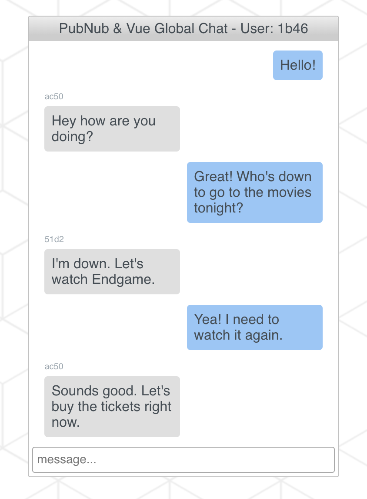

# Group Chat App in Vue.js
A simple group chat app, built with [PubNub's Vue V4 SDK](https://www.pubnub.com/docs/vue-javascript/pubnub-javascript-sdk#how-to-get-it-npm), that allows users to subscribe to a channel and publish messages to the group, all in realtime. Messages are saved to the network, using [Storage & Playback](https://www.pubnub.com/docs/vue-javascript/api-reference-storage-and-playback#history), so users can see past or missed messages. 



## Setup
1) First thing first, sign up for a free PubNub account to get your Pub/Sub API keys.

  <a href="https://dashboard.pubnub.com/signup?devrel_gh=Vue_Chat">
    
  </a>

2) To save the messages to history, go to your [PubNub Admin Dashboard](https://admin.pubnub.com), click on the Demo Project App, or create a new app for this project, and click on Keyset. Scroll down until your get to Storage & Playback. Toggle the switch to on and keep the default values the same.

3) Clone the repo.
```bash
git clone https://github.com/ocastroa/Vue_Chat.git
```
4) Open the project in your favorite text editor, such as [VS Code](https://code.visualstudio.com/download) or [Notepad++](https://notepad-plus-plus.org/download/v7.6.4.html)

5) Go to main.js and replace 'publish_Key' and 'subscribe_Key' with the keys you got from Step 1.

6) Install dependencies.
```bash
npm install
```

7) Serve with hot reload at localhost:8080.
```bash
npm run dev
```

8) Copy and paste the URL to another tab, or preferably a new window, and type a message in the message input. Press 'Enter' and you should see the message in both chat logs. Enter a couple more messages, then reload the page. Since Storage & Playback was enabled, the last 6 messages (you can change this number with 100 being the max) will show on the chat log.

## Build Your Own Group Chat App in Vue.js
To learn more about this project or if you want to build this project from scratch, check out the tutorial (coming soon).

  <a href="https://www.pubnub.com/blog?devrel_gh=Vue_Chat">
    
  </a>
